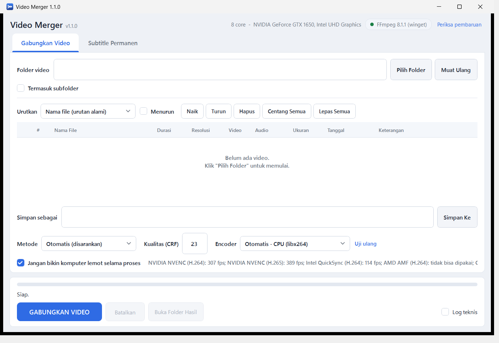
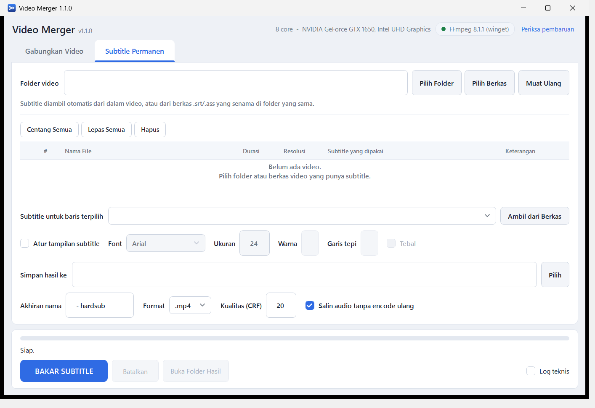

# Video Merger

Aplikasi Windows untuk menggabungkan **semua video dalam satu folder menjadi satu file**,
diurutkan berdasarkan nama file atau tanggal.

Dibuat untuk kasus seperti: 100 file rekaman CCTV masing-masing 5 menit → satu video 8 jam.



---

## Pemasangan

Ada dua cara, keduanya sah:

| Berkas | Untuk siapa |
|---|---|
| **`VideoMerger-1.1.0-Setup.exe`** — installer | Pemakaian biasa. Membuat pintasan Start Menu / Desktop, terdaftar di *Apps & features*, bisa dihapus rapi. Bisa dipasang **tanpa hak administrator** — pilih "Pasang hanya untuk saya". |
| **`VideoMerger.exe`** — satu file 374 KB, tanpa pasang | Dijalankan dari flashdisk atau folder jaringan, atau di PC yang melarang pemasangan. Tinggal klik dua kali. |

Keduanya tersedia di [halaman Releases](../../releases). Installernya 2,6 MB.

> Aplikasi ini belum ditandatangani secara digital, jadi Windows SmartScreen mungkin
> menampilkan peringatan saat pertama dijalankan. Klik **More info → Run anyway**.

Menghapus: lewat *Settings → Apps*, atau pintasan **Hapus Video Merger** di Start Menu.
Saat menghapus, aplikasi menanyakan apakah pengaturan dan FFmpeg yang pernah diunduh
(`%APPDATA%\vmerge`, bisa ±170 MB) ikut dibuang — jawab **Tidak** kalau Anda berencana
memasangnya kembali.

---

## Dua fungsi, dua tab

| Tab | Untuk apa |
|---|---|
| **Gabungkan Video** | Menyatukan banyak video jadi satu, urut nama atau tanggal. |
| **Subtitle Permanen** | Membakar subtitle ke dalam gambar (hardsub), supaya tampil di TV, DVD/VCD player, dan pemutar yang mengabaikan subtitle terpisah. |

### Format yang didukung

**MP4 dan MKV didukung penuh**, baik sebagai masukan maupun keluaran — begitu juga
MOV, AVI, TS, M2TS, WMV, FLV, WebM, MPG, 3GP, dan lainnya (33 ekstensi total).
Keluaran bisa `.mp4`, `.mkv`, `.mov`, `.ts`, `.avi`, `.webm`, `.flv`, `.mpg`.

---

## Menggabungkan video

1. Jalankan **`VideoMerger.exe`** (klik dua kali).
2. Masukkan videonya — ada tiga cara, semuanya setara:
   - **Pilih Folder** — seluruh isi folder;
   - **Pilih Berkas** — beberapa berkas tertentu saja (Ctrl+klik untuk banyak);
   - **seret dan lepas** berkas atau folder langsung ke tabelnya.
3. Periksa urutannya di daftar. Ubah lewat **Urutkan** atau geser baris dengan mouse.
4. Tentukan nama file hasil di kolom **Simpan sebagai**.
5. Klik **GABUNGKAN VIDEO**.

> Menjatuhkan **satu folder** sama dengan menekan Pilih Folder. Menjatuhkan
> **beberapa berkas** (atau campuran berkas dan folder) memuat persis yang
> dijatuhkan; kotak folder dikosongkan supaya "Muat Ulang" tidak diam-diam
> memindai folder lain. Kedua tab menerima jatuhan.

Kalau semua video punya format identik (kasus paling umum: satu kamera, satu pengaturan),
penggabungan berjalan **tanpa encode ulang** — 100 video berdurasi total 8 jam selesai
dalam hitungan menit, dan kualitasnya sama persis dengan aslinya.

---

## Subtitle permanen (hardsub)

Video `.mkv` sering membawa subtitle sebagai **trek terpisah** (softsub). Pemutar di
komputer bisa menampilkannya, tetapi TV, DVD/VCD player, dan pemutar USB umumnya
mengabaikan trek itu — videonya jalan, teksnya hilang. **Hardsub** menggambar teks
langsung ke dalam gambarnya, sehingga jadi bagian dari video dan tampil di mana pun.

1. Tab **Subtitle Permanen** → **Pilih Folder** (atau **Pilih Berkas** untuk satu video).
2. Aplikasi otomatis mencari subtitle untuk tiap video:
   - trek di **dalam** video — trek berbahasa Indonesia dipilih lebih dulu, lalu trek
     bawaan (*default*);
   - berkas **`.srt` / `.ass`** senama di folder yang sama, termasuk pola
     `Episode 01.id.srt`.
3. Mau ganti? Pilih barisnya, lalu tentukan di **Subtitle untuk baris terpilih**,
   atau klik **Ambil dari Berkas**.
4. Opsional: centang **Atur tampilan subtitle** untuk mengubah font, ukuran, warna,
   dan garis tepi. Tanpa ini, berkas `.ass` mempertahankan gayanya sendiri.
5. Klik **BAKAR SUBTITLE**.



> **Hardsub selalu meng-encode ulang gambar** — pikselnya berubah, jadi tidak ada
> jalan cepat seperti pada penggabungan. Audionya disalin apa adanya (tidak
> di-encode ulang), sehingga tidak ada penurunan kualitas suara dan prosesnya lebih
> cepat. Trek subtitle lunaknya dibuang dari hasil supaya teks tidak tergambar dua kali.

Subtitle berbasis **gambar** (PGS dari Blu-ray, VobSub dari DVD) juga didukung —
ditempelkan dengan `overlay`, bukan digambar ulang oleh libass.

Trek bertanda **paksa** (*forced*) sengaja tidak dipilih otomatis: trek itu hanya
memuat baris berbahasa asing, jadi membakarnya menghasilkan video yang hampir tanpa teks.

### Syarat

- **Windows 7 SP1 ke atas** (32-bit maupun 64-bit)
- **.NET Framework 4.8**. Sudah ikut Windows 10 versi 1903 ke atas dan Windows 11,
  jadi hampir semua PC sekarang tidak perlu memasang apa pun. Pada Windows 7 SP1 /
  8.1 perlu dipasang sekali dari Microsoft (gratis) — installernya memeriksa ini
  dan menawarkan halaman unduhannya kalau belum ada.
- **FFmpeg**. Aplikasi mencarinya otomatis. Kalau belum ada, saat pertama dijalankan
  aplikasi menawarkan untuk **mengunduhnya sendiri** (sekali saja, unduhan ±80 MB
  yang menempati ±170 MB di `%APPDATA%\vmerge`).
  Bisa juga dipasang manual: `winget install Gyan.FFmpeg`, atau taruh `ffmpeg.exe`
  dan `ffprobe.exe` di folder yang sama dengan `VideoMerger.exe`.

### Memperbarui FFmpeg

Chip status FFmpeg di pojok kanan atas punya tombol **Periksa pembaruan**.
Aplikasi juga memeriksa sendiri **sekali seminggu** saat dibuka — dibatasi
supaya membuka aplikasi tidak berarti satu permintaan jaringan setiap kali.

Kalau FFmpeg-nya **dipasang aplikasi ini**, pembaruannya langsung di tempat.

Kalau datang dari **winget/chocolatey/scoop**, aplikasi menawarkan dua jalan:

| Pilihan | Yang terjadi |
|---|---|
| **Unduh sendiri** | Versi baru dipasang di `%APPDATA%\vmerge\ffmpeg` dan langsung dipakai. Pemasangan winget Anda **tidak diubah sama sekali**. |
| **Salin perintah** | `winget upgrade Gyan.FFmpeg` disalin ke clipboard, tinggal ditempel di terminal. |

Yang tidak pernah dilakukan aplikasi adalah **menimpa berkas milik winget di
tempatnya**. Nama folder winget bernomor versi (`ffmpeg-8.1.1-full_build`), jadi
menimpanya membuat winget tetap mengira versi lama yang terpasang — dan
`winget upgrade` berikutnya akan membatalkan pekerjaan itu.

Memasang salinan sendiri aman karena urutan pencarian FFmpeg menaruh
`%APPDATA%\vmerge\ffmpeg` **sebelum** winget/chocolatey/scoop, jadi versi baru
langsung terpakai tanpa menyentuh apa pun milik alat lain. Urutan itu ada
tesnya, karena kalau bergeser pembaruan akan tampak berhasil lalu diam-diam
tidak terpakai.

---

## Pilihan pengurutan

| Pilihan | Kapan dipakai |
|---|---|
| **Nama file (urutan alami)** | Default. Persis seperti urutan di Windows Explorer — `video2` sebelum `video10`, bukan sesudahnya. |
| Nama file (A-Z biasa) | Urutan abjad murni. |
| **Tanggal rekam (otomatis)** | Paling tepat untuk rekaman. Pakai metadata di dalam file; kalau tidak ada, ambil tanggal dari nama file; kalau tidak ada juga, pakai tanggal diubah. |
| Tanggal rekam (metadata) | Hanya `creation_time` di dalam container (MP4/MOV/MKV). File `.ts` dan `.avi` tidak punya ini. |
| Tanggal dari nama file | Mengenali pola CCTV umum: `CH01_20240105080000`, `20240105_080000`, `2024-01-05 08.00.00`, termasuk varian Hikvision berakhiran milidetik. |
| Tanggal diubah | `mtime`. Bertahan saat file disalin dengan benar. |
| Tanggal dibuat | ⚠️ Di Windows ini berubah jadi *waktu menyalin* begitu file dipindah dari SD card/CCTV, sehingga semua file jadi berwaktu sama. Jangan dipakai untuk mengurutkan rekaman. |
| Durasi / Ukuran file | Untuk keperluan khusus. |

Urutan juga bisa diatur manual: pilih baris lalu tekan **▲ Naik** / **▼ Turun**, atau
seret baris dengan mouse. Baris bisa dicentang/dilepas untuk ikut atau tidak ikut digabung.

---

## Metode penggabungan

| Metode | Kecepatan | Kualitas | Kapan dipakai |
|---|---|---|---|
| **Otomatis** (default) | — | — | Memilih sendiri antara Cepat dan Hemat. Biarkan saja di pilihan ini. |
| **Cepat** (tanpa encode ulang) | ±80x lebih cepat | Identik dengan asli | Otomatis dipakai bila semua video punya parameter sama. |
| **Hemat** | Sedang | Sangat baik | Hanya video yang berbeda yang di-encode ulang, sisanya disalin apa adanya. |
| **Encode ulang semua** | Paling lambat | Sangat baik | Semua video diseragamkan. Dipakai bila format campur aduk parah. |

Perkiraan waktu untuk 100 video @5 menit (total 8 jam), diukur di i5-10300H:

- Cepat: **10–20 menit** untuk ±30 GB. Waktunya ditentukan jumlah BYTE, bukan durasi,
  jadi tergantung kecepatan disk (jauh lebih lama di HDD atau drive jaringan).
- Encode ulang dengan CPU (libx264): sekitar **1–2 jam**
- Encode ulang dengan GPU NVIDIA (NVENC): sekitar **25–50 menit**

### Encoder dipilih dengan diukur, bukan ditebak

Kolom **Encoder** bawaannya **Otomatis**, dan pilihannya ditentukan dengan
benar-benar menjalankan setiap encoder sebentar (720p, 150 frame) lalu
membandingkan fps-nya. Hasilnya disimpan, jadi pengukuran ini hanya terjadi
sekali — dan terulang kalau kartu grafis, driver, atau versi FFmpeg berubah.

Ini bukan kehati-hatian berlebihan. Hasil nyata di satu mesin uji
(Core i7 8 core + GTX 1650 + Intel UHD):

| Encoder | Kecepatan |
|---|---|
| NVIDIA NVENC (H.265) | 389 fps |
| **CPU (libx264)** | **318 fps** |
| NVIDIA NVENC (H.264) | 307 fps |
| Intel QuickSync (H.264) | 114 fps |
| AMD AMF | tidak jalan (tidak ada GPU AMD) |

Dua hal yang akan salah kalau ditebak: **QuickSync 2,8× lebih lambat daripada
CPU**, dan **NVENC H.264 pun kalah tipis**. Aturan "pakai perangkat keras kalau
ada" justru memperlambat di mesin ini.

Angka itu ikut tertulis **di tiap pilihan** pada kotak Encoder, jadi tidak perlu
menebak apa yang dipilih "Otomatis" atau seberapa jauh selisihnya. Encoder yang
terbukti tidak jalan tetap ditampilkan — supaya tidak ada yang bertanya "kenapa
AMD hilang?" — tetapi **tidak bisa dipilih**, dan diberi keterangan *tidak
didukung di PC ini*. Kalau pilihan tersimpan ternyata sudah mati (driver dicopot,
GPU diganti), kotaknya kembali ke Otomatis alih-alih menunjuk pilihan mati.

> **H.265 tidak pernah dipilih otomatis** walaupun paling cepat, karena memilihnya
> diam-diam mengubah codec keluaran jadi HEVC — dan HEVC persis yang tidak bisa
> diputar TV lama, pemutar DVD, dan perangkat USB yang jadi alasan aplikasi ini
> ada. Pilihannya tetap tersedia untuk yang memang menginginkannya.

`ffmpeg -encoders` hanya menyebut apa yang ikut dikompilasi, bukan apa yang bisa
dijalankan mesin ini: `h264_amf` tetap terdaftar di komputer tanpa GPU AMD dan
baru mati di frame pertama. Klik **Uji ulang** untuk mengukur lagi kapan saja.

Selama pengukuran berjalan, tombol aksi ditahan sebentar. Bukan kehati-hatian
berlebihan: kalau penggabungan dimulai bersamaan, kedua ffmpeg berebut CPU dan
angkanya jadi salah — terukur di mesin uji, libx264 turun **71%** saat semua core
sibuk sementara NVENC hanya 60%, sehingga pemenangnya berbalik. Hasil salah itu
lalu **tersimpan** bersama sidik jari perangkat keras dan bertahan sampai GPU atau
versi FFmpeg berubah. Tekan **Batalkan** kalau tidak mau menunggu; pengukuran yang
dibatalkan tidak disimpan sama sekali.

### Sisa folder kerja dibersihkan sendiri

Jalur normal — selesai, gagal, dibatalkan, jendela ditutup — selalu membuang
folder kerjanya. Yang tidak bisa ditangani dari dalam adalah proses yang mati
mendadak: dimatikan lewat Task Manager, listrik padam, Windows restart paksa.
Sisanya bisa **puluhan GB** klip ternormalisasi yang diam di folder tujuan.

Karena nama foldernya memuat PID pembuatnya, aplikasi bisa menjawab "masih
dipakai atau tidak": sebelum memulai pekerjaan baru, folder `.vmerge_tmp_*`
yang PID-nya sudah tidak hidup dihapus. Yang PID-nya masih hidup tidak
disentuh — bisa jadi itu jendela kedua yang sedang bekerja di folder yang sama.

### Supaya laptop tetap bisa dipakai

Centang **"Jangan bikin komputer lemot selama proses"** (aktif secara bawaan)
menjalankan FFmpeg pada prioritas di bawah normal. Prosesnya sendiri nyaris
tidak melambat — ia tetap memakai seluruh CPU yang menganggur — tetapi komputernya
tetap bisa dipakai mengetik dan membuka browser selama render berjam-jam.

Tampilannya sendiri sengaja dibuat murah: tidak ada bayangan, gradasi, maupun
animasi di seluruh berkas tema. Ketiganya yang membuat WPF terasa berat di
laptop tanpa akselerasi grafis, karena seluruh gambarnya jatuh ke CPU.

---

## Kenapa kadang harus encode ulang?

Menyambung video tanpa encode ulang hanya aman kalau **seluruh parameter teknisnya sama
persis**. Kalau dipaksakan, FFmpeg **tetap melaporkan sukses** tetapi hasilnya rusak diam-diam.
Contoh nyata yang diukur saat pengembangan:

- Dua klip 5 detik yang identik dalam segala hal **kecuali `time_base`** (15360 vs 30000)
  menghasilkan video **19,55 detik**, separuhnya diputar setengah kecepatan. Tanpa satu pun
  peringatan.
- 30 fps disambung ke 29,97 fps: 10 detik jadi 19,5 detik.
- Satu klip tanpa trek audio di tengah daftar: video tergabung penuh dan audio tetap
  berjalan, tetapi ada **bagian senyap** sepanjang klip tersebut — tanpa peringatan apa pun.
- Beda sample rate audio (44,1 kHz vs 48 kHz): tidak ada error, tapi audio makin melenceng
  seiring waktu.
- Beberapa klip direkam tegak dan beberapa menyamping (HP): rotasi tersimpan sebagai
  metadata container, bukan di dalam gambar, sehingga hasil gabungan hanya memakai
  orientasi klip pertama dan sisanya tampil miring.

Karena itu aplikasi ini **selalu memeriksa 22 parameter** tiap file lewat `ffprobe`
sebelum memutuskan, dan menampilkan alasannya kalau mode cepat tidak bisa dipakai.

## Perlindungan hasil terpotong

FFmpeg mengembalikan kode sukses (0) **walaupun** salah satu file gagal dibuka di tengah
proses — output tinggal beberapa detik dari yang seharusnya berjam-jam. Aplikasi ini:

1. **Membuka semua file dulu** sebelum mulai, dan menolak jalan kalau ada yang hilang,
   terkunci, atau drive jaringannya terputus.
2. **Membaca log FFmpeg** dan memperlakukan "Impossible to open" / "Error during demuxing"
   sebagai kegagalan, walaupun FFmpeg sendiri melaporkan sukses.
3. **Mengukur durasi hasil** setelah selesai — durasi keseluruhan *dan* durasi gambar
   secara terpisah — lalu membandingkannya dengan total durasi masukan. Toleransinya
   dihitung per sambungan (0,05 detik untuk mode cepat, 0,30 detik untuk encode ulang)
   dan dibatasi maksimal setengah durasi klip terpendek. Batas persentase sengaja
   **tidak** dipakai: 2% dari 8 jam adalah 10 menit, cukup untuk kehilangan dua klip
   utuh tanpa ketahuan.

---

## Mode baris perintah

`VideoMerger.exe` juga bisa dipanggil dari Command Prompt / PowerShell / Task Scheduler:

```bat
REM lihat daftar video dan urutannya saja, tanpa menggabung
VideoMerger.exe -i "D:\CCTV\Januari" --list

REM gabungkan
VideoMerger.exe -i "D:\CCTV\Januari" -o "D:\hasil.mp4"

REM termasuk subfolder, urut tanggal rekam, pakai GPU NVIDIA
VideoMerger.exe -i "D:\CCTV" -r -s recorded -o "D:\hasil.mp4" --encoder h264_nvenc

REM untuk tugas terjadwal: gagalkan kalau ada satu saja file yang tidak terbaca
VideoMerger.exe -i "D:\CCTV\Januari" -o "D:\hasil.mp4" --strict
```

| Argumen | Arti |
|---|---|
| `-i, --input FOLDER` | folder sumber |
| `-o, --output FILE` | file hasil |
| `-r, --recursive` | ikut memindai subfolder |
| `-s, --sort` | `name`, `recorded`, `modified`, `created`, `media_created`, `name_ts`, `duration`, `size` |
| `--desc` | urutkan menurun |
| `-m, --mode` | `auto`, `copy`, `smart`, `reencode` |
| `--crf N` | kualitas encode ulang (14–32, makin kecil makin bagus) |
| `--preset` | preset x264, mis. `veryfast`, `medium` |
| `--encoder` | mis. `h264_nvenc`, `h264_qsv`, `h264_amf` |
| `--strict` | berhenti dengan kode galat 5 kalau ada file yang dilewati (berguna untuk Task Scheduler, supaya 97 dari 100 rekaman tidak diam-diam dianggap sukses) |
| `--list` | hanya tampilkan daftar |
| `--full-speed` | pakai prioritas normal. Bawaannya di bawah normal supaya komputer tetap bisa dipakai selama render — pakai ini di mesin yang memang khusus merender |

### Hardsub dari baris perintah

```bat
REM lihat video mana saja yang punya subtitle, tanpa memproses
VideoMerger.exe --hardsub -i "D:\Film" --list

REM bakar subtitle seluruh folder, hasil ke folder terpisah
VideoMerger.exe --hardsub -i "D:\Film" --out-dir "D:\Film\hardsub"

REM satu berkas saja, pakai .srt tertentu
VideoMerger.exe --hardsub -i "D:\Film\Episode 1.mkv" --sub-file "D:\Film\id.srt"

REM pilih trek berbahasa Indonesia, font besar untuk ditonton di TV
VideoMerger.exe --hardsub -i "D:\Film" --sub-lang ind --sub-style --sub-size 32
```

| Argumen | Arti |
|---|---|
| `--hardsub` | bakar subtitle, bukan menggabungkan. `-i` boleh folder **atau** satu berkas |
| `--sub-file FILE` | pakai berkas `.srt`/`.ass` ini untuk semua video |
| `--sub-track N` | pakai trek subtitle ke-N di dalam video (mulai dari 1) |
| `--sub-lang KODE` | pilih trek berdasarkan bahasa, mis. `ind`, `eng` |
| `--sub-style` | terapkan `--sub-font` dan `--sub-size` |
| `--suffix` | akhiran nama hasil (default `" - hardsub"`) |
| `--out-dir FOLDER` | folder hasil (default: di samping video asli) |
| `--container` | format hasil, mis. `.mp4` atau `.mkv` |

Kode keluar `1` kalau ada video yang gagal, walaupun sebagian berhasil — supaya tugas
terjadwal tidak menganggapnya sukses.

Jalankan `VideoMerger.exe --help` untuk daftar lengkap.

---

## Membangun ulang dari sumber

Syarat:

```bat
winget install Microsoft.DotNet.SDK.8
winget install Microsoft.DotNet.Framework.DeveloperPack_4
```

Lalu:

```bat
build.bat          REM bangun saja
build.bat test     REM bangun lalu jalankan 130 tes
```

Hasilnya `dist\VideoMerger.exe`, **satu berkas 374 KB**.

`VideoMerger.Core.dll` ditanam ke dalam exe sebagai *embedded resource* dan dimuat
lewat `AssemblyResolve`, supaya menyalin exe-nya sendirian ke flashdisk tetap
bekerja. Dua hal membuat trik ini gagal diam-diam, dan keduanya sudah kena sekali
di sini:

- Target MSBuild-nya **harus** `AfterTargets="ResolveReferences"`. Hook yang lebih
  awal tidak pernah dijalankan pada proyek WPF; build tetap sukses dan exe-nya
  hanya kurang isi — baru ketahuan saat disalin sendirian.
- `Main` tidak boleh menyentuh satu pun tipe dari Core. CLR memuat assembly saat
  metode yang memakainya **di-JIT**, bukan saat barisnya dijalankan, jadi
  pemuatannya terjadi sebelum `AssemblyResolve` sempat terpasang.

FFmpeg sengaja **tidak** dibundel: `ffmpeg.exe` build lengkap berukuran 217 MB,
sehingga aplikasi 374 KB akan membengkak jadi ratusan MB.

### Membuat installer

Syarat tambahan: [Inno Setup 6](https://jrsoftware.org/isdl.php) —
`winget install JRSoftware.InnoSetup`.

```bat
build_installer.bat
```

Skrip ini membangun exe-nya dulu, lalu mengompilasi
`installer\Output\VideoMerger-1.1.0-Setup.exe` (±12 MB). Inno Setup dicari di
Program Files maupun di `%LOCALAPPDATA%\Programs` (lokasi yang dipakai winget kalau
dipasang tanpa hak admin), jadi tidak perlu ada di PATH.

Untuk **installer offline penuh** — pengguna tidak perlu mengunduh FFmpeg sama sekali —
taruh `ffmpeg.exe` dan `ffprobe.exe` di folder `ffmpeg\` di akar proyek sebelum
menjalankan skrip. Keduanya akan terdeteksi otomatis dan ikut dipasang ke
`<folder aplikasi>\ffmpeg\`, salah satu lokasi pertama yang dicari aplikasi.
Perhatikan kewajiban lisensi FFmpeg kalau installer itu Anda sebarkan — lihat
[LICENSE](LICENSE).

Set `VMERGE_NOPAUSE=1` supaya skrip tidak berhenti menunggu tombol (dipakai CI).

Uji installer tanpa mengklik apa pun:

```bat
VideoMerger-1.1.0-Setup.exe /VERYSILENT /CURRENTUSER /DIR=C:\uji\vm
C:\uji\vm\unins000.exe /VERYSILENT
```

### Menjalankan tes

```bat
dotnet run --project src\VideoMerger.Tests -c Release
```

130 tes, semuanya menjalankan FFmpeg sungguhan. Beberapa di antaranya lebih dulu
**membuktikan** kerusakannya nyata sebelum memeriksa bahwa aplikasi menolaknya.

Tes hardsub-nya juga tidak percaya pada kode keluar: video sumbernya **hitam polos**,
lalu luminansi puncak di seperempat bawah gambar diukur ulang. Kalau tidak ada teks
yang benar-benar tergambar, angkanya tetap 16 (hitam) dan tesnya gagal — walaupun
FFmpeg melaporkan sukses.

---

## Struktur proyek

```
VideoMerger.sln
src/
  VideoMerger.Core/         mesin - tanpa UI, dipakai bersama GUI, CLI, dan tes
    Models.cs               kontrak data + signature kompatibilitas 22 field
    Shell.cs                proses anak Windows: CreateNoWindow, kutip argumen
    FFmpegLocator.cs        mencari / mengunduh ffmpeg
    FFmpegTask.cs           menjalankan satu ffmpeg: progres, batal, deteksi gagal
    Prober.cs               pembacaan ffprobe paralel
    Scanner.cs              memindai folder
    Sorting.cs              urutan alami (StrCmpLogicalW) + parser tanggal
    Hardware.cs             nama CPU/GPU + sidik jari untuk cache benchmark
    EncoderBenchmark.cs     mengukur encoder mana yang tercepat di mesin ini
    FFmpegUpdater.cs        periksa & pasang FFmpeg versi baru
    Merger.cs               menyusun perintah penggabungan
    Subtitles.cs            menemukan & menyiapkan subtitle
    Hardsubber.cs           mesin subtitle permanen
    AppSettings.cs          preferensi di %APPDATA%\vmerge\settings.ini
  VideoMerger.App/          WPF
    Program.cs              titik masuk: GUI atau CLI
    Theme.xaml              palet & gaya (satu-satunya tempat warna)
    MainWindow.xaml(.cs)    jendela, kedua tab
    Rows.cs                 pembungkus baris tabel (INotifyPropertyChanged)
    Cli.cs                  antarmuka baris perintah
    EmbeddedAssemblies.cs   memuat Core.dll dari dalam exe
  VideoMerger.Tests/        130 tes, semuanya menjalankan FFmpeg sungguhan
build.bat                   bangun exe
build_installer.bat         bangun exe + installer
installer/setup.iss         skrip Inno Setup
.github/workflows/          CI: uji, bangun, terbitkan rilis saat tag "v*"
```

Preferensi pengguna disimpan di `%APPDATA%\vmerge\settings.json`.

---

## Batasan yang diketahui

- File `.dav` bawaan Dahua yang ber-header proprietary tidak terbaca FFmpeg dan akan
  dilewati; `.dav` yang isinya H.264 mentah terbaca tapi durasinya tidak diketahui
  sehingga ikut dilewati.
- Setiap sambungan menambah selisih beberapa milidetik. Pada 100 file, total selisihnya
  beberapa detik dari video 8 jam — tidak terasa, tapi bukan nol.
- Drive tujuan berformat FAT32 tidak bisa menampung file lebih dari 4 GB. Pakai NTFS
  atau exFAT untuk hasil berdurasi panjang.
- Menyimpan hasil sebagai **`.mkv`** dari sumber MP4 memunculkan peringatan
  "non monotonic DTS" di setiap sambungan. Filenya tetap utuh dan bisa diputar; ini
  sifat bawaan FFmpeg (jeda encoder AAC di MP4 tidak punya padanan di Matroska),
  bukan akibat penggabungan. Keluaran **`.mp4`** — yang menjadi default — bersih total.
- Aplikasi tidak menandatangani kode (code signing), jadi saat pertama diunduh
  Windows SmartScreen bisa menampilkan peringatan. Pilih "More info" lalu
  "Run anyway". Windows Defender sendiri tidak menganggapnya ancaman.

---

## Lisensi

[MIT](LICENSE).

Video Merger tidak menyertakan atau menautkan kode FFmpeg — ia memanggil `ffmpeg.exe`
dan `ffprobe.exe` sebagai program terpisah. Kalau Anda menyebarkan installer dengan
FFmpeg ikut dibundel, kewajiban lisensi FFmpeg (LGPL/GPL) berlaku untuk distribusi
tersebut. Lihat [ffmpeg.org/legal.html](https://ffmpeg.org/legal.html).
